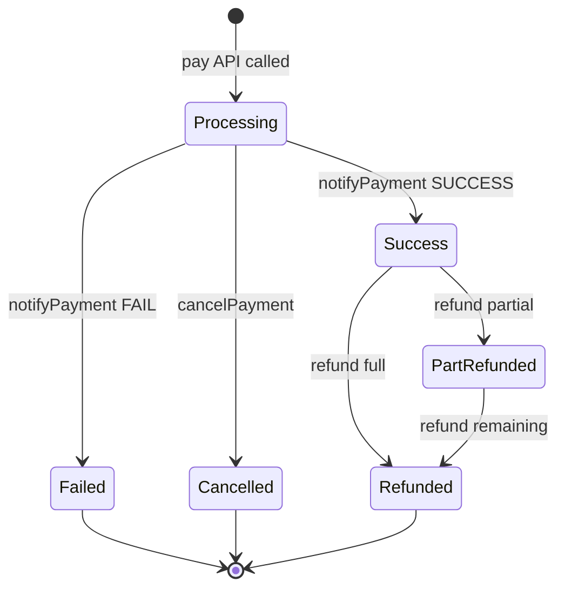
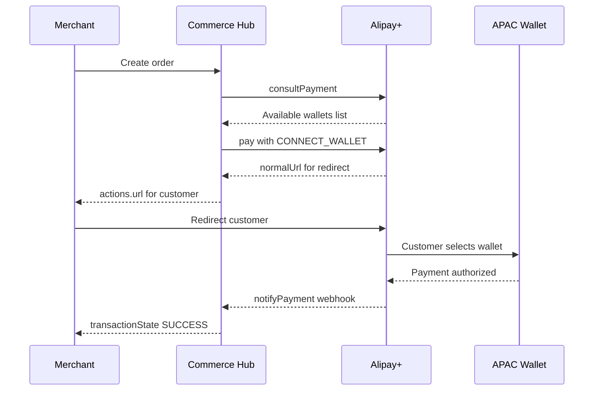
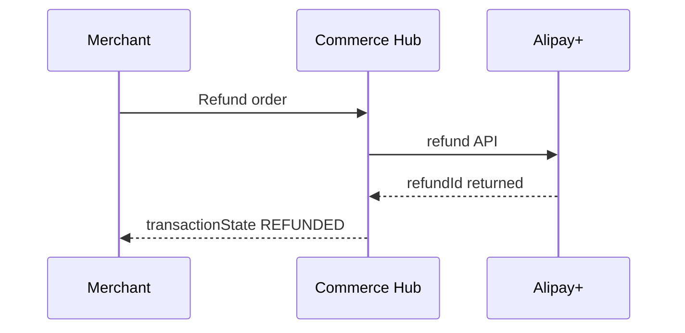

# PRD: Alipay+ Direct Integration — Commerce Hub

```yaml
commerceHubVersion: 1.26.0302
providerApiVersion: Alipay+ v1
provider: Direct (not via PPRO)
targetApm: Alipay+
category: QR_CODE / REDIRECT
regions: APAC (PH, SG, MY, TH, KR, ID, HK, JP, CN, IN)
currencies: PHP, SGD, MYR, THB, KRW, IDR, HKD, JPY, CNY, INR, USD
confidence: verified
safetyChecksPassed: true
```

---

## 1. Executive Summary

Alipay+ is a cross-border payment platform by Ant Group that aggregates 16+ APAC e-wallets (Alipay, GCash, KakaoPay, Touch 'n Go, DANA, TrueMoney, Boost, Rabbit LINE Pay, mPay, etc.) through a single API integration.

**Pattern**: QR-code / redirect hybrid
**Capabilities**: auth (consultPayment + pay), refund, partial-refund, cancel, inquiry
**Note**: No separate capture — Alipay+ auto-captures at payment time

**Mapping Chain**:


**Key Differentiator**: Amount values are STRING minor units ("1000" = $10.00), not integer or decimal. This requires unique DECIMAL_TO_STRING_CENTS / STRING_CENTS_TO_DECIMAL transforms.

**Supported Wallets via CONNECT_WALLET**: Alipay, GCash, KakaoPay, Touch n Go, DANA, TrueMoney, Boost, Rabbit LINE Pay, mPay, Tinaba, BPI, Gcash, HelloMoney, and more.

---

## 2. Commerce Hub API Mapping

See `mapping-ch-to-alipayplus.md` for complete field-level tables.

### Auth (consultPayment + pay)

| CH Field | Alipay+ Field | Transform | Tier |
|---|---|---|---|
| amount.total | paymentAmount.value | DECIMAL_TO_STRING_CENTS | 1 |
| amount.currency | paymentAmount.currency | PASSTHROUGH | 1 |
| transactionDetails.merchantOrderId | paymentRequestId | PASSTHROUGH | 1 |
| merchantDetails.merchantId | order.merchant.referenceMerchantId | PASSTHROUGH | 1 |
| paymentMethod.provider | paymentMethod.paymentMethodType | MAP_ENUM: ALIPAYPLUS to CONNECT_WALLET | 1 |
| checkoutInteractions.channel | order.env.terminalType | MAP_ENUM: WEB to WEB | 1 |
| checkoutInteractions.returnUrls.successUrl | paymentRedirectUrl | PASSTHROUGH | 1 |

### Refund

| CH Field | Alipay+ Field | Transform | Tier |
|---|---|---|---|
| referenceTransactionDetails.referenceTransactionId | paymentId | PASSTHROUGH | 1 |
| transactionDetails.merchantOrderId | refundRequestId | PASSTHROUGH | 1 |
| amount.total | refundAmount.value | DECIMAL_TO_STRING_CENTS | 1 |
| amount.currency | refundAmount.currency | PASSTHROUGH | 1 |

---

## 3. Ucom Adapter Specification

Add ALIPAYPLUS to FundingSourceType enum.

```yaml
AlipayPlus:
  type: object
  properties:
    walletType:
      type: string
      description: Selected APAC wallet identifier
      readOnly: true
    normalUrl:
      type: string
      description: Redirect URL for customer wallet selection
      readOnly: true
    paymentData:
      type: string
      description: SDK data for in-app payment flow
      readOnly: true
    pspId:
      type: string
      description: Payment Service Provider ID of selected wallet
      readOnly: true
```

See `adapter-spec-ucom.md` for full specification.

---

## 4. SnapPay Adapter Specification

See `adapter-spec-snappay.md`. Same B2B unmappable fields as other APMs (companycode, branchplant, supplier, clxstream).

---

## 5. Transaction Lifecycle



### Auth Flow



### Refund Flow



---

## 6. Safety Check Results

All 6 safety checks PASS. See `safety-check-report.md`.

---

## 7. Sandbox Testing Plan

1. consultPayment: verify available wallets for PH/PHP
2. pay with CONNECT_WALLET: verify normalUrl returned
3. inquiryPayment: verify payment status
4. cancelPayment: verify cancellation
5. refund: verify refundId returned
6. Amount symmetry: CH 500.00 to A+ "50000" to CH 500.00

---

## 8. Unmappable Fields

See `unmappable-fields.md`.
