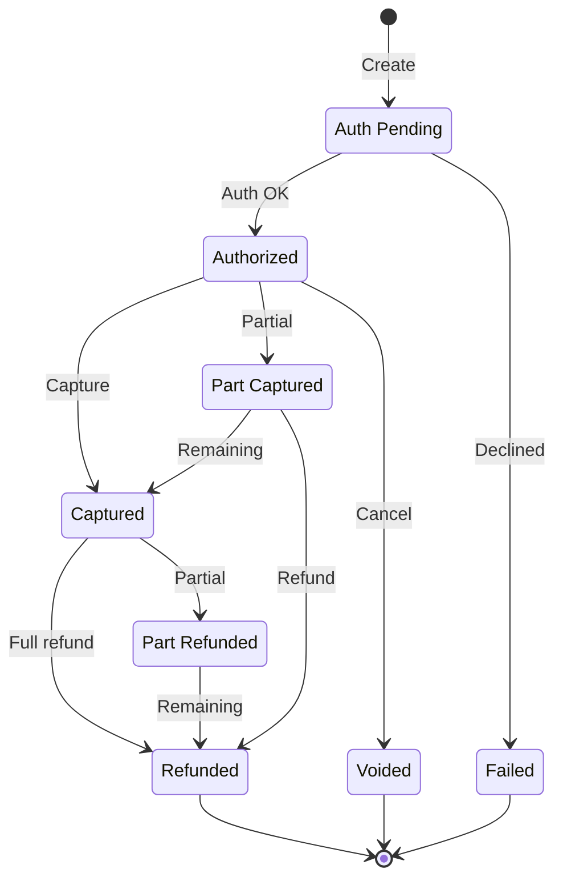
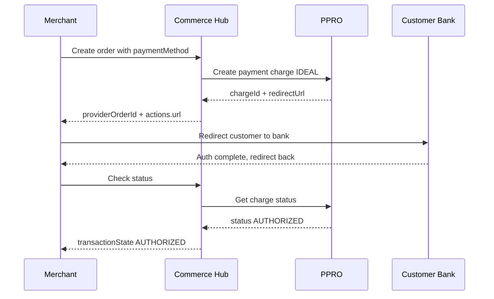
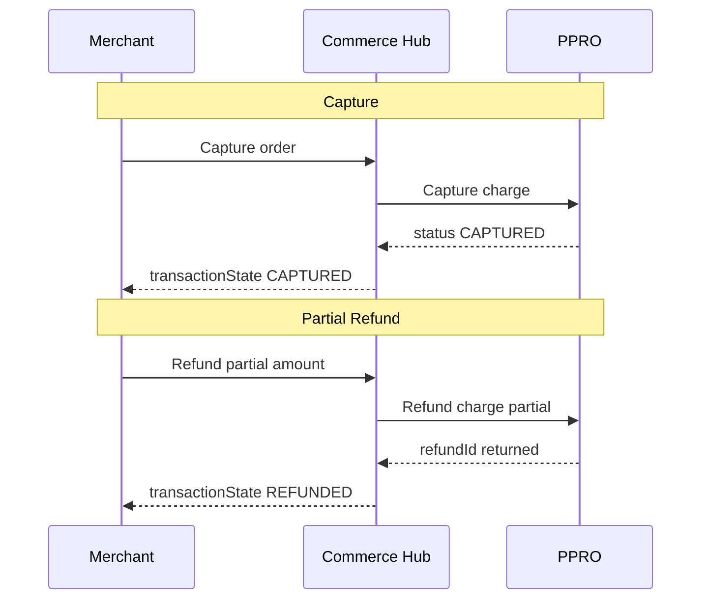

# PRD: iDEAL Bank Redirect Integration via PPRO Aggregator

```yaml
commerceHubVersion: 1.26.0302
providerApiVersion: PPRO v1
aggregator: PPRO
targetApm: iDEAL
ucomVersion: 0.2.3
snappayVersion: 3.0.9
generatedAt: 2026-04-12T07:02:00Z
patternTemplate: bank-redirect-v1
goldenMappingSource: "NONE -- generated from sandbox discovery"
confidence: generated
safetyChecksPassed: true
sandboxValidated: true
sandboxUrl: https://api.sandbox.eu.ppro.com
```

---

## 1. Executive Summary

This PRD defines the integration of iDEAL (Netherlands bank redirect) as an Alternative Payment Method (APM) through Commerce Hub's `POST /checkouts/v1/orders` endpoint (v1.26.0302), routed via PPRO as the payment aggregator.

**Scope**: Four transaction capabilities -- auth, capture, refund, and void -- for the Netherlands market, EUR currency only.

**Integration pattern**: Bank redirect via PPRO aggregator. The mapping chain is:


PPRO acts as an aggregation layer between Commerce Hub and iDEAL. Instead of integrating directly with iDEAL's banking infrastructure, Commerce Hub sends a single standardized request to PPRO's `POST /v1/payment-charges` endpoint with `paymentMethod: "IDEAL"`. PPRO handles the downstream routing, bank selection, and redirect orchestration.

**Transaction flow**:

1. Create payment charge via PPRO (`POST /v1/payment-charges`)
2. Customer redirected to their bank for authentication (status: AUTHENTICATION_PENDING)
3. Customer completes bank authentication and is redirected back to merchant
4. Payment authorized (status: AUTHORIZED)
5. Capture payment (`POST /v1/payment-charges/{id}/captures`)
6. Refund or void as needed

**Key differentiator vs. direct APM integrations**: The PPRO aggregator model means the same API contract (`POST /v1/payment-charges`) is reused for iDEAL, Bancontact, Pix, and other APMs. The only field that changes is `paymentMethod`. This makes adding new APMs through PPRO incremental rather than requiring a new integration per APM.

**Confidence level**: Generated. This mapping was validated against the live PPRO sandbox at `https://api.sandbox.eu.ppro.com` on 2026-04-12 with actual successful iDEAL, Bancontact, and Pix charge creations. No golden mapping source exists for PPRO -- all field paths were discovered through sandbox interaction and response inspection.

**Safety checks**: All six safety checks pass. Amount symmetry is confirmed across all capabilities (MULTIPLY_100 on request, DIVIDE_100 on response).

---

## 2. Commerce Hub API Mapping

The complete field-level mapping is documented in `mapping-ch-to-ppro-ideal.md`. This section summarizes the key mapping characteristics.

### Mapping Summary by Capability

| Capability | PPRO Endpoint | Request Fields | Response Fields | Key Transform |
|---|---|---|---|---|
| Auth (Create Charge) | POST /v1/payment-charges | 10 fields mapped | 9 fields mapped | MULTIPLY_100 for amount |
| Capture | POST /v1/payment-charges/{id}/captures | 1 field mapped | 2 fields mapped | MULTIPLY_100 / DIVIDE_100 |
| Refund | POST /v1/payment-charges/{id}/refunds | 1 field mapped | 2 fields mapped | MULTIPLY_100 / DIVIDE_100 |
| Void | POST /v1/payment-charges/{id}/voids | No body | Status change | State derived from response |

### Aggregator-Specific Mapping Characteristics

PPRO introduces an aggregator layer that differs from direct APM integrations:

1. **Single endpoint, multi-APM**: The `paymentMethod` field (e.g., "IDEAL", "BANCONTACT", "PIX") determines routing. All other fields are shared across APMs.
2. **Minor units only**: PPRO uses integer minor units for all amounts. Commerce Hub uses decimal. MULTIPLY_100 on every request, DIVIDE_100 on every response.
3. **UPPERCASE enum requirement**: The `paymentMethod` field MUST be uppercase ("IDEAL", not "ideal"). PPRO rejects lowercase values.
4. **HATEOAS links**: PPRO responses include `_links` for captures, refunds, and voids. Commerce Hub does not use HATEOAS -- these links are consumed internally and not exposed to merchants.

### Transform Rules

| Transform | Direction | Description |
|---|---|---|
| MULTIPLY_100 | Request (CH to PPRO) | Convert decimal to minor units (10.00 to 1000) |
| DIVIDE_100 | Response (PPRO to CH) | Convert minor units to decimal (1000 to 10.00) |
| PASSTHROUGH | Both | No modification |
| MAP_ENUM | Both | Status code mapping between CH and PPRO enums |
| MAP_ENUM + UPPER | Request | Enum mapping with forced uppercase (e.g., "IDEAL") |
| CONCAT | Request | Concatenate firstName + " " + lastName into consumer.name |

---

## 3. Ucom Adapter

### Schema Changes

| Change | Detail |
|---|---|
| FundingSourceType enum | Add `IDEAL` value |
| iDEAL FundingSource object | New object with `bankRedirectUrl` (string, readOnly), `chargeId` (string, readOnly) |

### Field Mapping Chain (Ucom to Commerce Hub to PPRO to iDEAL)

| Ucom Field | CH Field | PPRO Field | Notes |
|---|---|---|---|
| requestedAmount | amount.total | amount.value (MULTIPLY_100) | Ucom and CH both use decimal; transform at CH-to-PPRO boundary |
| currencyCode | amount.currency | amount.currency | EUR only for iDEAL |
| customer.email | customer.email | consumer.email | Required by PPRO |
| customer.firstName + lastName | customer.firstName + lastName | consumer.name (CONCAT) | PPRO uses single name field |
| customer.country | customerAddress.country | consumer.country | "NL" for iDEAL |
| fundingSource.type | paymentMethod.provider | paymentMethod | MAP_ENUM: IDEAL -> "IDEAL" |
| orderId | transactionDetails.merchantOrderId | merchantPaymentChargeReference | Merchant reference |
| redirectUrl | checkoutInteractions.returnUrls.successUrl | authenticationSettings[0].settings.returnUrl | Post-auth redirect |

### Auth Bridging

Same pattern as CashApp and Klarna: HMAC recompute at the adapter boundary. PPRO auth uses Bearer token + Merchant-Id header -- this is handled at the CH-to-PPRO boundary, not exposed to Ucom.

### Key Challenge: Bank Redirect Flow

Unlike card-based or BNPL flows, the iDEAL bank redirect requires the merchant to redirect the customer to an external URL returned by PPRO. The Ucom adapter must:
1. Extract `authenticationMethods[0].details.requestUrl` from the PPRO response
2. Surface it as `fundingSource.ideal.bankRedirectUrl` to the Ucom merchant
3. The merchant redirects the customer to this URL
4. After bank authentication, the customer is redirected to the configured returnUrl
5. The merchant polls or receives a webhook to confirm AUTHORIZED status

Full adapter specification in `adapter-spec-ucom.md`.

---

## 4. SnapPay Adapter

### Field Mapping Chain (SnapPay to Commerce Hub to PPRO to iDEAL)

| SnapPay Field | CH Field | PPRO Field | Notes |
|---|---|---|---|
| transactionamount | amount.total | amount.value (MULTIPLY_100) | Transform at CH-to-PPRO boundary |
| currencycode | amount.currency | amount.currency | EUR |
| customer.email | customer.email | consumer.email | Required |
| customer.customername | customer.firstName + lastName | consumer.name | SPLIT_ON_SPACE at SnapPay boundary, then CONCAT at PPRO boundary |
| customer.country | customerAddress.country | consumer.country | "NL" |
| redirecturl | checkoutInteractions.returnUrls.successUrl | authenticationSettings[0].settings.returnUrl | Post-auth redirect |
| orderid | transactionDetails.merchantOrderId | merchantPaymentChargeReference | Merchant reference |

### B2B Unmappable Fields

Same B2B unmappable fields as CashApp and Klarna. These SnapPay fields have no PPRO equivalent and are dropped at the adapter boundary:

- `companycode` -- B2B company identifier
- `branchplant` -- B2B branch/plant code
- `supplier{}` -- supplier metadata
- `clxstream[]` -- CLX stream data

### Key Advantage: Simpler Than BNPL

iDEAL via PPRO is a simpler integration than Klarna BNPL for SnapPay. No line-item data is required. The core fields are amount, currency, consumer identity, country, and return URL. SnapPay's existing redirect-capable `GetRequestID` + `charge` flow maps cleanly.

Full adapter specification in `adapter-spec-snappay.md`.

---

## 5. Transaction Lifecycle

### State Machine



### Auth Flow



### Capture + Refund Flow



### State Transitions

| From State | Action | To State | Reversible |
|---|---|---|---|
| (none) | Create Payment Charge | AUTHENTICATION_PENDING | Via discard |
| AUTHENTICATION_PENDING | Customer authenticates at bank | AUTHORIZED | No |
| AUTHENTICATION_PENDING | Customer cancels / timeout | AUTHENTICATION_FAILED | No |
| AUTHORIZED | Capture (full) | CAPTURED | Via refund only |
| AUTHORIZED | Capture (partial) | PARTIALLY_CAPTURED | Additional captures possible |
| AUTHORIZED | Void | VOIDED | No |
| CAPTURED | Refund (full) | REFUNDED | No |
| CAPTURED | Refund (partial) | PARTIALLY_REFUNDED | Additional refunds possible |

### PPRO Status to Commerce Hub State Mapping

| PPRO Status | CH transactionState |
|---|---|
| AUTHENTICATION_PENDING | PAYER_ACTION_REQUIRED |
| AUTHORIZED | AUTHORIZED |
| CAPTURED | CAPTURED |
| REFUNDED | REFUNDED |
| VOIDED | VOIDED |
| AUTHENTICATION_FAILED | DECLINED |

### Timing Constraints

- **Auth expiry**: iDEAL bank redirects typically expire within 15-30 minutes if the customer does not complete authentication
- **Capture window**: Authorized payments should be captured promptly. PPRO does not enforce a strict window but bank-redirect payments are expected to be captured within hours, not days
- **Refund window**: Refunds can be issued up to 365 days after capture (bank-dependent)

---

## 6. Safety Check Results

All safety checks passed. Full details in `safety-check-report.md`.

| # | Check | Status | Summary |
|---|---|---|---|
| 1 | Amount Symmetry | PASS | MULTIPLY_100 on request, DIVIDE_100 on response for all capabilities |
| 2 | Currency Preservation | PASS | ISO-4217 EUR passes through with no modification |
| 3 | ID Uniqueness | PASS | Each PPRO ID maps to exactly one CH field; no fan-out |
| 4 | Tier 1 Coverage | PASS | All Tier 1 fields mapped |
| 5 | Bidirectional Completeness | PASS | Every request amount has a corresponding response amount |
| 6 | Return URL Validation | PASS | returnUrl is mapped to authenticationSettings[0].settings.returnUrl and echoed in redirectUrl |

---

## 7. Sandbox Testing Plan

Mapping validated against PPRO sandbox at `https://api.sandbox.eu.ppro.com` on 2026-04-12.

### Test Cases

| # | Test | Endpoint | Expected Result | Sandbox Status |
|---|---|---|---|---|
| 1 | Create iDEAL charge | POST /v1/payment-charges | 201 with charge_id, status=AUTHENTICATION_PENDING, redirectUrl present | Validated (charge_oc43q4PDbViOlkzoweDXQ) |
| 2 | Amount conversion round-trip | Create charge + read | Send 10.00 (CH) -> verify PPRO receives 1000 -> verify response returns 10.00 | Validated |
| 3 | Redirect URL populated | Create charge response | authenticationMethods[0].details.requestUrl is non-empty GET URL | Validated |
| 4 | Capture authorized charge | POST /v1/payment-charges/{id}/captures | 200/201 with captured amount | Requires completed bank auth |
| 5 | Partial refund of captured charge | POST /v1/payment-charges/{id}/refunds | 200/201 with refund amount | Requires completed capture |
| 6 | Void authorized uncaptured charge | POST /v1/payment-charges/{id}/voids | 200 with status=VOIDED | Requires completed bank auth |
| 7 | Cross-APM contract validation | Create charges for IDEAL, BANCONTACT, PIX | Same response structure, different paymentMethod values | Validated |

### Sandbox Configuration

| Property | Value |
|---|---|
| Base URL | https://api.sandbox.eu.ppro.com |
| Auth | Bearer token + Merchant-Id header |
| Test country | NL |
| Test currency | EUR |
| Test charge ID | charge_oc43q4PDbViOlkzoweDXQ |

### Test Dependencies

Tests 4, 5, and 6 require a completed bank authentication flow, which depends on customer interaction with the iDEAL bank redirect page. Sandbox testing for these capabilities requires either:

- A PPRO-provided test flow that auto-completes bank authentication, or
- Manual testing through the sandbox redirect URL where a simulated bank page auto-approves

---

## 8. Unmappable Fields

Full details in `unmappable-fields.md`. Summary below.

### PPRO Fields With No Commerce Hub Equivalent (5 fields)

| Field | Impact | Resolution |
|---|---|---|
| paymentMedium ("ECOMMERCE") | None | PPRO-specific channel descriptor; CH uses its own channel model |
| scheduleType ("UNSCHEDULED") | None | PPRO scheduling metadata; not applicable for one-time bank redirects |
| instrumentId | Low | Different semantics than CH tokenData; log for reconciliation |
| _links (HATEOAS) | None | PPRO navigation links consumed internally; CH does not expose HATEOAS |
| authenticationMethods[].details.requestMethod | None | CH does not track HTTP method of redirect URL |

### Commerce Hub Fields With No PPRO Equivalent (5 fields)

| Field | Impact | Resolution |
|---|---|---|
| merchantDetails.storeId | Low | PPRO identifies merchants at account level via Merchant-Id header |
| merchantDetails.terminalId | None | Not applicable for e-commerce |
| encryptionData | None | Not applicable for bank redirect |
| splitShipment | None | Not applicable for bank redirect (no line items) |
| dynamicDescriptors.mcc | Low | PPRO manages MCC at merchant account level |

No unmappable field blocks the integration. All gaps have documented resolutions.
